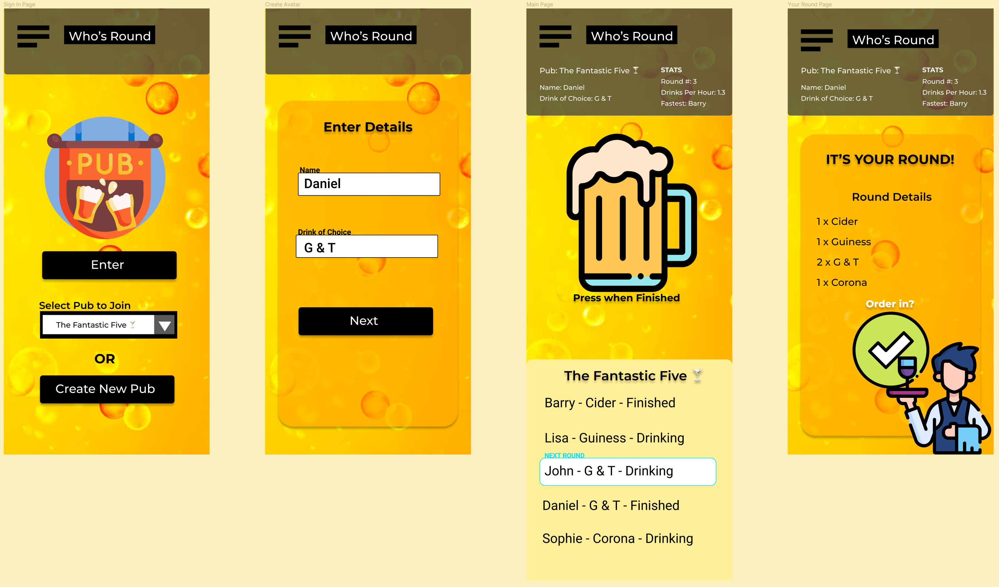

<h1 id='Title'>Who's Round</h1>

A React Native app built on the Expo platform. An app that tracks the drinking consumption of a group; keeps track of who's buying the next round and the drinks list.

<h1>Tech Stack</h1>

<div align="center">
  
  
  
  
  
  
</div>

<br>

<div align="center">
  
</div>
<br>
<h1>Features</h1>

• Users input their name and drink of choice

• User is then directed to main page where all other users details are displayed

• User presses beer icon when finished their drink to notify participants

• When all users drinking status is finished, the app will notify the buyer of the next round with a list of drinks to buy

<h1>Features in Progress</h1>

• User sign up and authentication

• Database of users

• Conversion from JavaScript into TypeScript

<h2 id='wireframes'>Wireframes</h2>



<br>
<h1 id='getting-started'>Getting Started</h1>

These instructions will help you setup a local development instance of the app.

<h2 id='clone'>Get the repo</h2>

```
git clone https://github.com/Daniel-Slattery/whos-round
```

<h2 >Navigate to the folder</h2>

```
cd whos-round
```

<h2>Install the dependencies</h2>

```
cd client-react
npm i
cd ../server
npm i
```

<h2>Run server</h2>

```
node server.js
```

<h2>Start new terminal and navigate to client</h2>

```
cd client
```

<h2>Run client to start app</h2>

```
npm start
```
